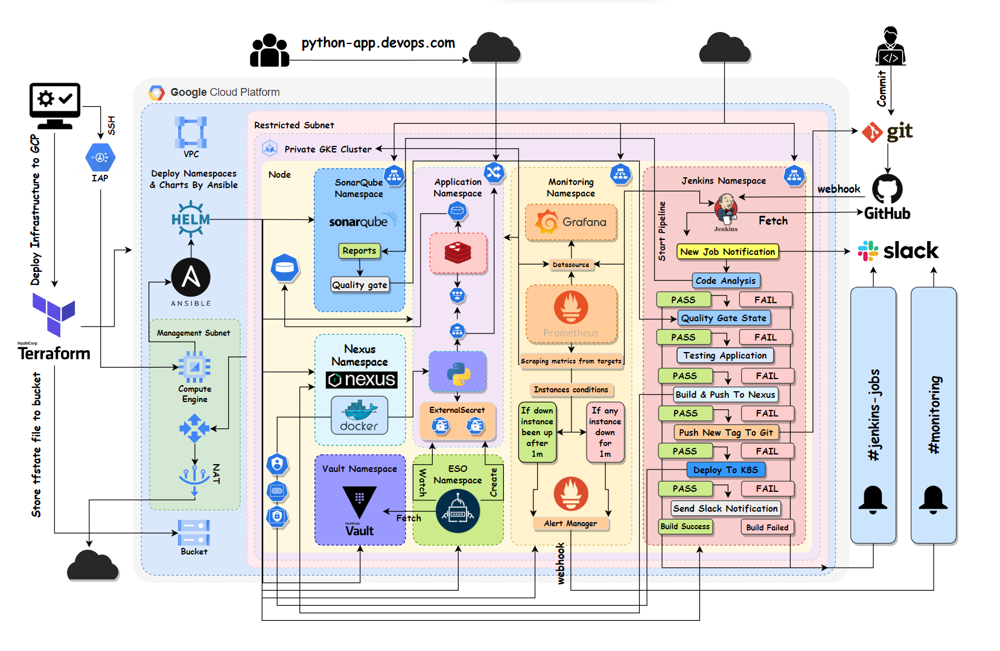
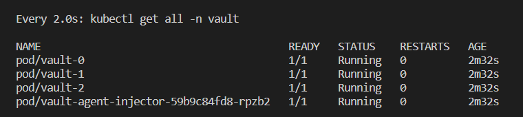
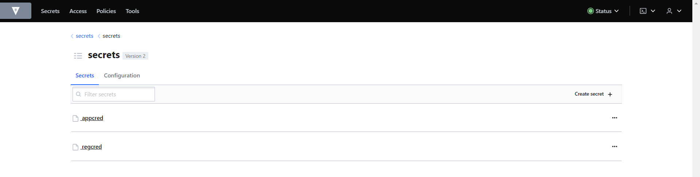
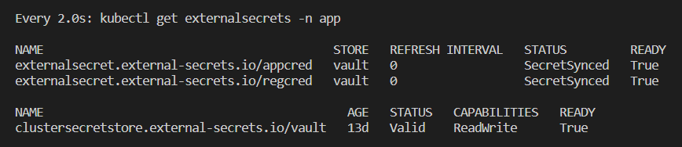

# Fully-Integrated-Pipeline-Project
Introducing a pipeline project integrating with several popular DevOps tools. I tried to make everything as automated, secure, reliable, and logical as possible.
a complete cycle that can simulate a real environment on companies, a process that can produce good & secure software quality with good sights for each resource inside the infrastructure.



# Getting started

- During the project, I used several tools that can handle each part and I would like to provide each tool with a little explanation :
    - `Terraform` - for deploying the required infrastructure on Google Cloud Provider (GCP)
    - `Docker` - for building the application image.
    - `Kubernetes` - for deploying the application & database manifests, and helm charts.
    - `Ansible` - for automating some tasks inside the cluster like creating the namespaces, deploying the helm charts on each namespace and configuring the Hashicorp Vault cluster.
    - `Helm` - for deploying some required helm charts like Jenkins, Hashicorp Vault, External-secrets, SonarQube, Prometheus, and Grafana, I tried to make my custom values for each Helm package.
    - `Prometheus` - as a data source for Grafana. to scrape the metrics from several configured targets.
    - `Grafana` - for visualization, watch each target metric.
    - `SonarQube` - for automatic code reviews, delivers a clean & safe code.
    - `Nexus` - to store the images privately inside the Cluster.
    - `Hashicorp Vault` - as a free & great solution for storing secrets.
    - `External-Secrets` - configured with Hashicorp Vault for managing the secrets inside each namespace.
    - `Jenkins` - as a CI/CD automation tool.
    - `Slack` - as a notifications channel configured with Prometheus & Jenkins.
    - `Redis` - as a database server required to be available for the 
   application.
- I will talk about each part of the project with each tool used in it.


# Building the infrastructure with Terraform

- Building a VPC with 2 subnets, each subnet will have different sources.
- The first subnet will be Management (Public) with these resources :
    - An instance that will be used to access the cluster control plane privately.
    - This instance will be configured with a script to have preinstalled tools like ansible, kubectl, gcloud-cli, and helm.
- The second subnet will be restricted (Private) and associated with a router, and nat gateway so the resources can access the internet without external IP. this subnet will have these resources :
    - A private GKE cluster is configured with a private control plane to be accessed only from a CIDR range, this range will be the Management subnet range so the instance only can access the cluster control plane.
- A service account is bound with a role to be able to create the cluster and also for the instance to be able to manage the cluster.
- A firewall with IAP access to be able to SSH into the Management instance privately.
- A google storage bucket for storing tfstate file of terraform and syncing any new changes has been made inside the infrastructure.

# Managing the cluster with Ansible

- After the resources have been deployed by Terraform, it would be necessary to configure the cluster using Ansible, for that I need first to ssh into the management instance to be able to communicate with the cluster.
```
gcloud compute ssh project-340821-management-vm --project project-340821 --zone europe-west1 --tunnel-through-iap
```
- Now i can implement the Ansible playbook.
```
ansible-playbook --ask-become-pass Ansible.yaml
```


- This Ansible playbook will perform several tasks :
    - Connect to the GKE cluster.
    - Create several namespaces, each namespace will contain different deployments/helm charts.
    - Deploy the helm charts of `Jenkins` `Vault` `External-Secrets` `Prometheus` `Grafana` `SonarQube` and the `Nexus` deployments.
    - Deploy the Jenkins roles into its namespace.
    - Initiate the hashicorp Vault cluster.

# Setting up secrets with Hashicorp Vault

- After the deployment of the helm charts had been completed, we must set up the secrets inside the cluster in the first step to make sure that all the required secrets are available. to perform that we need to check if the Hashicorp Vault cluster is up and ready state is 1/1.



- Now we can access the Vault UI and set up our credentials. in this case, I need to set up 2 different types of secrets:
    - the first one is the application credentials necessary for the application to be able to communicate with the Redis database server so the manifest type of the secret will be `Opaque`.
    - the second one is the container credentials. because we have a private nexus registry and we want the application container to be able to authenticate with the repo. we must set up a credentials type `kubernetes.io/dockerconfigjson` with the repo link, user, and password.



# Setting up External Secrets Operator with Hashicorp Vault

- External secret operator (ESO) is a Kubernetes Operator which can integrate with an external secrets manager like Vault or AWS secret manager or Google Secrets Manager, I found it a great idea if I made integrate with Vault so its free & great solution for handling the secrets inside the cluster.
    - First, we need to set up a SecretStore with Vault so it can pull any secrets being requested from it. 
    - A secret with the vault token so it can be able to access the vault and pull the secrets from it.
    - There are 2 types of SecretStores :
        - `SecretStore` - it can only handle the secrets inside a specific namespace.
        - `ClusterSecretStore` - it can handle the secrets across all the namespaces inside the cluster.
    - I choose the second type because I would like to handle all the namespaces secrets at once with one SecretStore so it will be a more convenient way.
- After setting up the SecretStore with Vault it must be able to connect with Vault and pull the requested secrets then create each one on the app namespace once we deploy the application.



# Setting up Nexus registry

- The second important thing is to set up the registry which will be used to store our application images which will be built by Jenkins, in this case, I tried to use Nexus to simulate security reasons related to the companies like they sometimes would prefer to store the images locally. Although you can create your private registries online with Docker hub or Github container registry it's still a better & preferred idea for most companies.
- I tried to use Nexus helm charts from the official repo but I found some permission issues so I tried to create a deployment for the Nexus registry.
- I set up 2 Containers
    - Initial container with a busybox image for setting the appropriate ownership and permissions on the `/nexus-data` directory before the Nexus container starts running. it will change the ownership of the `/nexus-data` directory to the user with ID 200, which matches the UID of the non-root user that the Nexus container will run as. This ensures that the Nexus container will have the necessary permissions to read and write data in the `/nexus-data` directory ( this was a problem with the Nexus helm charts that's why I made a special deployment for it).
    - Nexus contianer has the official Nexus image with 2 ports opened. the first is 8081 and it is the important port to be able to access the Nexus UI. 5000 which will be used to push the images by it.
- Also to make sure that we have enough storage for storing our images inside Nexus, I created a Persist volume claim attached with Persist volume with enough space to test the pipeline.
- Now the Nexus registry is up and ready to push/pull images to it.


# Setting up Jenkins

- As the most popular CI/CD tool today, I loved to use Jenkins to manage the pipeline of the project. especially because Jenkins can use several useful plugins which can be helpful to automate some jobs. 
- I used Jenkins Helm charts because I always like to customize Jenkins with my personal configurations, here is how my custom values file has been set :
    - Setting Jenkins with some plugins to be preinstalled like :
        - `Kubernetes` - because I like to use different agents to perform Jenkins jobs.
        - `Configuration as code` - useful plugin to set up Jenkins configurations like global configurations, global system configuration or even any other installed plugins. I used it to set up Slack configurations, SonarQube plugin,  Prometheus plugin, some unwanted security warnings, and some credentials.
        - `Prometheus` - I need Jenkins metrics to be pushed at a special path pattern, by installing this plugin I can find the Jenkins metrics at the path `/Prometheus`. this way I can set up Jenkins as a target for the Prometheus server to be able to scrape its metrics also every 5 secs the metrics will be pushed to the path.
        -  `Disk usage` - in some cases this plugin must be available if we use Prometheus plugin, this will provide all the disk usage by Jenkins.
        - `Blue ocean` - a great customized UI for Jenkins, a good sight for the jobs, and check the logs better and more tidily.
        - `Sonar` - iam using sonarQube on this project so Jenkins must integrate & authenticate with the sonar server to perform a security scan automatically with every build.
        - `Sonar Quality gates` - after the sonarQube scan has been done, it will end with success or failure, using this plugin with webhook configured will help me to continue the pipeline process or to end it with failure. important because maybe the code has a higher percentage of security issues or the code is not clean enough and SonarQube marked this code as not accepted for building in this case it will be better to stop the pipeline and recheck the code.
        - `Docker pipeline` - a better way to build the docker images inside Jenkins.
        - `Slack` - i would like to receive a notifications when there is a build started or for each stage failed or successful and at the end of the pipeline if the build is totally successful or failed, in this case, slack must be the best option available.


during this project, Jenkins will integrate with several tools. let's talk about each step.
    - One of the 