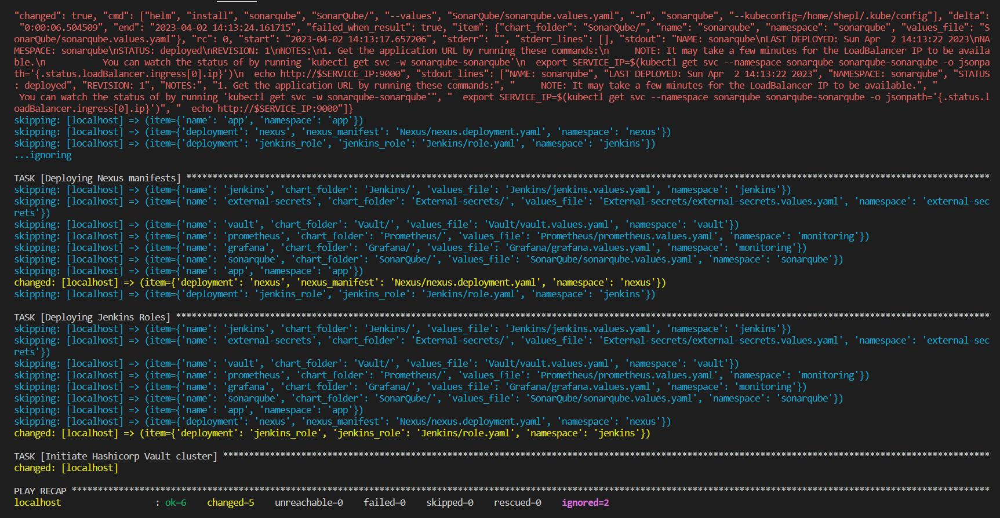
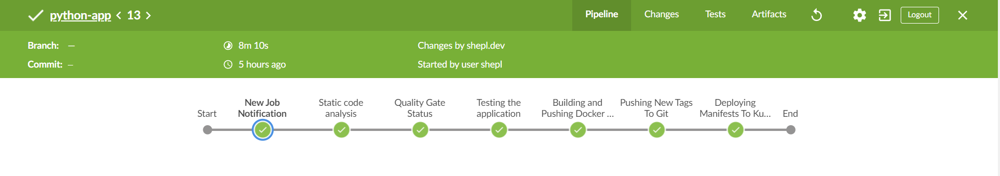
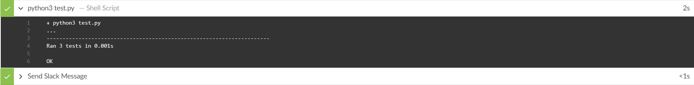
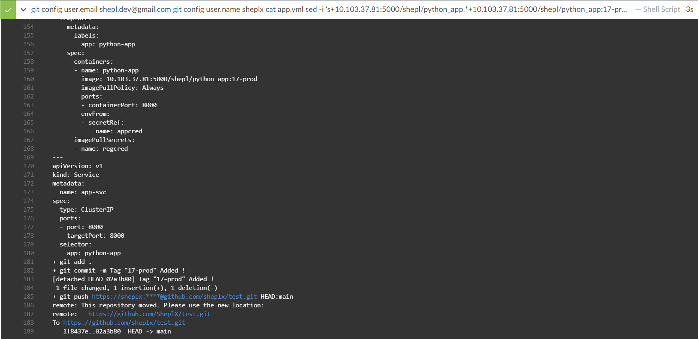

# Fully Integrated Pipeline
Introducing a pipeline project integrating with several popular DevOps tools. I tried to make everything as automated, secure, reliable, and logical as possible.
a complete cycle that can simulate a real environment on companies, a process that can produce good & secure software quality with good sights for each resource inside the infrastructure.


# Getting started

- During the project, I used several tools that can handle each part and I would like to provide each tool with a little explanation :
    - `Terraform` - for deploying the required infrastructure on Google Cloud Provider (GCP).
    - `Docker` - for building the application image.
    - `Kubernetes` - for deploying the application & database manifests, and helm charts.
    - `Ansible` - for automating some tasks inside the cluster like creating the namespaces, deploying the helm charts on each namespace and configuring the Hashicorp Vault cluster.
    - `Helm` - for deploying some required helm charts like `Jenkins` `Hashicorp Vault` `External-secrets` `SonarQube` `Prometheus` and `Grafana`. I tried to make my custom values for each Helm package.
    - `Prometheus` - as a data source for Grafana. to scrape the metrics from several configured targets.
    - `Grafana` - for visualization, watch each target metric.
    - `SonarQube` - for automatic code reviews, delivers a clean & safe code.
    - `Nexus` - to store the images privately inside the Cluster.
    - `Hashicorp Vault` - a free & great solution for storing secrets.
    - `External-Secrets` - configured with Hashicorp Vault for managing the secrets inside each namespace.
    - `Jenkins` - as a CI/CD automation tool.
    - `Slack` - as a notifications channel configured with Prometheus & Jenkins.
    - `Redis` - as a database server required to be available for the 
   application.
- I will talk about each part of the project with each tool used in it.


# Building the infrastructure with Terraform

- Building a VPC with 2 subnets, each subnet will have different sources.
- The first subnet will be Management (Public) with these resources :
    - An instance that will be used to access the cluster control plane privately.
    - This instance will be configured with a script to have preinstalled tools like Ansible, kubectl, gcloud-cli, and Helm.
- The second subnet will be restricted (Private) and associated with a router, and nat gateway so the resources can access the internet without external IP. This subnet will have these resources :
    - A private GKE cluster is configured with a private control plane to be accessed only from a CIDR range, this range will be the Management subnet range so the instance only can access the cluster control plane.
- A service account is bound with a role to be able to create the cluster and also for the instance to be able to manage the cluster.
- A firewall with IAP access to be able to SSH into the Management instance privately.
- A Google storage bucket for storing tfstate file of terraform and syncing any new changes has been made inside the infrastructure.

# Managing the cluster with Ansible

- After the resources have been deployed by Terraform, it would be necessary to configure the cluster using Ansible, for that I need first to ssh into the management instance to be able to communicate with the cluster.
```
gcloud compute ssh project-340821-management-vm --project project-340821 --zone europe-west1 --tunnel-through-iap
```
- Now i can implement the Ansible playbook.
```
ansible-playbook --ask-become-pass Ansible.yaml
```


- This Ansible playbook will perform several tasks :
    - Connect to the GKE cluster.
    - Create several namespaces, each namespace will contain different deployments/helm charts.
    - Deploy the helm charts of `Jenkins` `Vault` `External-Secrets` `Prometheus` `Grafana` `SonarQube` and the `Nexus` deployments in each created namespace.
    - Deploy the Jenkins roles into its namespace.
    - Initiate the hashicorp Vault cluster.

# Setting up secrets with Hashicorp Vault

- After the deployment of the helm charts had been completed, we must set up the secrets inside the cluster in the first step to make sure that all the required secrets are available. to perform that we need to check if the Hashicorp Vault cluster is up and ready state is 1/1.


- Now we can access the Vault UI and set up our credentials. in this case, I need to set up 2 different types of secrets:
    - the first one is the application credentials necessary for the application to be able to communicate with the Redis database server so the manifest type of the secret will be `Opaque`.
    - the second one is the docker credentials. because we have a private nexus registry and we want the application container to be able to authenticate with the repo & pull. we must set up a credentials type `kubernetes.io/dockerconfigjson` with the repo link, user, and password.


# Setting up External Secrets Operator with Hashicorp Vault

- External secret operator (ESO) is a Kubernetes Operator which can integrate with an external secrets manager like Vault or AWS secret manager or Google Secrets Manager, I found it a great idea if I made integrate with Vault so its free & great solution for handling the secrets inside the cluster.
    - First, we need to set up a SecretStore with Vault so it can pull any secrets being requested from it. 
    - A secret with the vault token so it can be able to access the vault and pull the secrets from it.
    - There are 2 types of SecretStores :
        - `SecretStore` - it can only handle the secrets inside a specific namespace.
        - `ClusterSecretStore` - it can handle the secrets across all the namespaces inside the cluster.
    - I choose the second type because I would like to handle all the namespaces secrets at once with one SecretStore so it will be a more convenient way.
- After setting up the SecretStore with Vault it must be able to connect with Vault and pull the requested secrets then create each one on the app namespace once we deploy the application.


# Setting up Nexus registry

- The second important thing is to set up the registry which will be used to store our application images which will be built by Jenkins, in this case, I tried to use Nexus to simulate security reasons related to the companies like they sometimes would prefer to store the images locally. Although you can create your private registries online with Docker Hub or GitHub container registry it's still a better & preferred idea for most companies.
- I tried to use Nexus helm charts from the official repo but I found some permission issues so I tried to create a deployment for the Nexus registry.
- I set up 2 Containers
    - Initial container with a busybox image for setting the appropriate ownership and permissions on the `/nexus-data` directory before the Nexus container starts running. it will change the ownership of the `/nexus-data` directory to the user with ID 200, which matches the UID of the non-root user that the Nexus container will run as. This ensures that the Nexus container will have the necessary permissions to read and write data in the `/nexus-data` directory ( this was a problem with the Nexus helm charts that's why I made a special deployment for it ).
    - Nexus container has the official Nexus image with 2 ports opened. the first is 8081 and it is the important port to be able to access the Nexus UI. 5000 which will be used to push the images by it.
- Also to make sure that we have enough storage for storing our images inside Nexus, I created a Persist volume claim attached with Persist volume with enough space to test the pipeline.
- Now the Nexus registry is up and ready to push/pull images to it.


# Setting up SonarQube

- SonarQube is one of the most important tools that must be available if you like to have a clean & safe code or need more wise checks for your code described with great reports.
- Sonar is available to perform a security scan for code if you have your code inside a folder or a remote repository, if Windows or Linux. Sonar is also available for Jenkins to integrate with the pipeline and this is an awesome feature.
- In my case, I used Sonar to scan my Python code through the Jenkins pipeline, also I can see some checks for my Dockerfile.
- Quality gates checker condition according to the scan results if successful or failed to make sure that build releases are secured.
- We must set up some configurations for SonarQube to be able to communicate with Jenkins:
    - Set up a new project, with a name to be configured with the application code by the properties file. this will tell the scanner which project to push the analytics of the scanned code.
    - Qualitly gates must be configured with a webhook between sonar and Jenkins to be able to approve or deny according to the build results so Jenkins can continue the pipeline or stop it.
    - A sonar token is required to authenticate with Jenkins for scanning or quality gate cases.
- Once Jenkins performs the scanning job, sonar will receive the scanning reports and analyze them.


- And because the build is passed successfully, the quality gates step must reply to Jenkins with a success status to continue the pipeline steps.


# Setting up Jenkins

- As the most popular CI/CD tool today, I loved to use Jenkins to manage the pipeline of the project. especially because Jenkins can use several useful plugins which can be helpful to automate some jobs. 
- I used Jenkins Helm charts because I always like to customize Jenkins with my configurations, here is how my custom values file has been set :
    - Setting Jenkins with some plugins to be preinstalled like :
        - `Kubernetes` - because I like to use different agents to perform Jenkins jobs.
        - `Configuration-as-code` - useful plugin to set up Jenkins configurations like global configurations, global system configuration or even any other installed plugins. I used it to set up Slack configurations, SonarQube plugin, Prometheus plugin, some unwanted security warnings, and some credentials.
        - `Prometheus` - I need Jenkins metrics to be pushed at a special path pattern, by installing this plugin I can find the Jenkins metrics at the path `/Prometheus`. this way I can set up Jenkins as a target for the Prometheus server to be able to scrape its metrics also every 5 secs the metrics will be pushed to the path.
        
        -  `Disk-usage` - in some cases, this plugin must be available if we use the Prometheus plugin, this will provide all the disk usage by Jenkins.
        
        - `Blue-ocean` - a great customized UI for Jenkins, a good sight for the jobs, and check the logs better and more tidily.
        - `Sonar` - I am using SonarQube on this project so Jenkins must integrate & authenticate with the sonar server to perform a security scan automatically with every build.
        - `Sonar-Quality-gates` - after the SonarQube scan has been done, it will end with success or failure, using this plugin with webhook configured will help me to continue the pipeline process or to end it with failure. important because maybe the code has a higher percentage of security issues or the code is not clean enough and SonarQube marked this code as not accepted for building in this case it will be better to stop the pipeline and recheck the code.
        - `Docker-pipeline` - a better way to build the docker images inside Jenkins.
        - `Slack` - I would like to receive notifications when there is a build started or for each stage failed or successful and at the end of the pipeline if the build is successful or failed, in this case, slack must be the best option available.
    - Set up a specific User and Password if inside the values or from a separate token.
    - Jenkins custom image, service type.
    - Persistent volume, persistent volume claim.
    - Jenkins agent configurations, capacity, and image.
    - Jenkins service account with the appropriate roles for deploying inside the cluster.
- Once Jenkins is up and running with the above configurations we will need to create some required tokens for the pipeline like authentication with Slack, Nexus registry, Git repository, and SonarQube scanner.
- A webhook between the Repository and Jenkins server so once any new commits have been added to the repository, GitHub will tell Jenkins about it so Jenkins can start the pipeline automatically.
- Now we can start the pipeline.



- The pipeline is configured with 2 agents:
    - `Kubectl` - To be able to deploy inside my cluster, it will be a good idea to use a container to handle this thing. I see it as a good solution if you can't connect with your cluster by Jenkins.
    - `Docker` - For building & push the application image, we will need a Docker-cli connected with the docker demon. I tried to build the image from scratch to make sure that I use a lightweight agent.  

- The stages consist of 7 stages, with a post-action for each stage to tell Slack if this stage is passed or failed. I tried to be very precise with each stage for making troubleshooting easier if a stage failed, by this way, we can watch everything just from Slack. and finally, a post-action that tells if the build success or failure and the time used during the pipeline process.

    - `Stage 1` - just to send a notification to Slack to tell that there is a new build started with a description of the job like the job name, number, description, and a button that lets u directly open the job page if you want to check it.
    
    

    - `Stage 2` - Code analysis with SonarQube, Jenkins will authenticate with Sonar and start the scan process.

    
    
    

    - `Stage 3` - Testing the Application, an automated test of some functions of the app to make sure that there are no bugs or errors.

    

    - `Stage 4` - Quality gates status, after the code analysis process is done, Jenkins must wait for the Quality gates to reply if the build is passed then Jenkins will continue the pipeline, if not passed then Jenkins will Stop the pipeline.

    

    - `Stage 5` - Building and pushing the image to the Nexus repository after the quality gate marked the code as passed.
    
    
    

    - `Stage 6` - Push the new tag to Git, once a new build is out, we must edit the Application deployment with the new image tag.

    

    - `Stage 7` - Deploy the application manifests to the cluster. by the appropriate roles configured to the service account attached to Jenkins, it can deploy, check, and create any group of resources we want. in my case, I tried to create roles for Jenkins to be able to deploy custom CRDs not authorized to Jenkins by default like external secrets, vault, ingress, pv, pvc. sure these things must be set for the first time to the application by Cluster admin, not by Jenkins but I just wanted to provide the Jenkins service account power to do that also I loved to try how can I create a custom unique group of roles and if that can be accepted by Jenkins or not. however, it's a great thing if you have control over your cluster resources. 

    
    
- After all the pipeline stages are finished, a post-action will send a msg to Slack with build success or failure. here are the full results from Slack.


# The Application & Database

- A simple Python app that connects to Redis DB and stores its numerical values on it. so with each hit, it will generate a new number value and save it on the Redis server.
- The application uses several environment variables.
They need to be available at runtime. Here is an overview of the environment variables:
    - `ENVIRONMENT` is the environment in which the application is run. Likely `PROD` for production or - - `DEV` for development context.
    - `HOST` the hostname on which the application is running. Locally it is `localhost`.
    - `PORT` is the port on which the application is running.
    - `REDIS_HOST` is the hostname on which Redis is running. Locally it is `localhost`.
    - `REDIS_PORT` is the port on which to communicate with Redis. Normally it is `6379`.
    - `REDIS_DB` which redis db should be used. Normally it is `0`.
- These variables will be stored as secrets in the vault server so that once the application will be deployed the external secrets operator will create a secret have these variables for the app and will pull the variables from the vault server which is stored into a custom path `secrets/appcred`.
- The second secret is required for the application to be able to pull the image inside the container from the Nexus repository and it is also stored in the vault server under this path `secrets/regcred`.
- The application has an Ingress object connected to the application's internal service so it can be accessed by custom DNS name. this ingress has a certification, issuer as a secret reference for the certification connects to the Let's Encrypt staging server so the certificate will generate a custom secret object issued by the Let's Encrypt issuer and then assign it to a custom DNS in my case it will be `python-app.devops.com`. then I can use it as a vailed certificate with ingress for my custom DNS.


# Setting up Prometheus & Grafana

- For several cases, it's very important to watch what's happening to your cluster or your application or even some targets you want to check its metrics. to achieve this, tools such as Prometheus and Grafana provide enormous help for good care of your resources.
Because several configurations must be done for both Prometheus and Grafana, it would be a nice idea to use helm packages for each tool configured with custom values. here are my custom configurations.
    - Setting up Jenkins job for pulling metrics by Prometheus. Jenkins with Prometheus plugin can push its metrics to Prometheus. this can be achieved by setting Jenkins target & path so Prometheus can reach Jenkins correctly.
    - Setting up alert manager with some rules. this is an awesome feature if you want to set some alerts to specific targets with some conditions. in my case, I set an alert to check all the instances inside my cluster if any instance is down for 1m send a message describing the down target and some information about it also if this instance is back and up send back a message to inform me. an additional thing for letting Prometheus reach the alert manager to send these alerts once any condition is achieved. I had to configure Prometheus with the alert manager endpoint.
    - Setting up Slack notifications with Prometheus. To receive the above alerts, I set the alert manager to check these alerts. but if the cluster node is down, this not going to work. so I set up Prometheus with a Slack webhook to be able to receive the alerts outside the cluster. the slack configuration will read the alert rules and send a notification whenever the condition is vailed for some instance.
    - Setting up custom user and password for both Prometheus and Grafana.
- Now Prometheus and Grafana must be ready.


- After both charts are up and ready if we take a look at Prometheus UI, we can see that Jenkins metrics are available and we can create some dashboards to it using Grafana. sure there are more metrics configured by default on Prometheus charts for the cluster, nodes, deployments, pods, services, and much more.


- We can see our configured rules are available too.


- Prometheus targets will be monitored by the rules and conditions, as you see all instances are up. we can see Jenkins's job between them too.


- Let's test if the alert conditions are working or not, for example, I will try to scale down Jenkins pods to 0 to check what will happen, after 1 m I found that Jenkins target is down and the alert is working as expected.


- If we take a look from the Alert Manager UI, we will see a notification about the Jenkins instance too.


- From slack


- Let's set Jenkins back by scaling up Jenkins pod again.


- After making sure that Prometheus is running ok, we can use Grafana by setting up Prometheus as Datasource. we just need to add the Prometheus endpoint to Grafana and test the connection.


- In order to check Jenkins metrics, we need to add some dashboards which been configured with Jenkins metrics.


- I also want to add some dashboards for the cluster.


- Let's try to create custom dashboards, for example, I want to check pod metrics for my Python application if it's up and running or not. I will select pod metrics that have a ready status and create a new query. we will find the pod is up and running.


